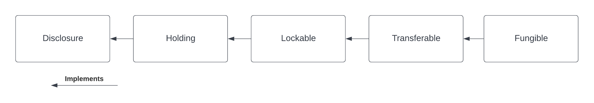

# Getting started tutorial

This tutorial introduces the core asset model of the library through a simple example. The purpose is to illustrate the concepts of [account](../../Glossary.md#account), [instrument](../../Glossary.md#instrument), and [holding](../../Glossary.md#holding), as well as showing how to work with Daml interfaces. ADD LINK TO INTERFACE PAGE

We are going to

- create an account for `Alice` and `Bob` at the `Bank`
- issue a cash instrument
- credit a holding on the cash instrument to Alice's account
- transfer the holding from Alice to Bob

## Download and build the code for the example

Add `daml new` when possible.

As a pre-requisite, the `Daml SDK` needs to be installed on your machine.

You can find the code for the project in the `example` folder. Navigate to the folder and run the `get_dependencies.sh` script in order to download the required `daml-finance` libraries. You can then use `daml studio` to follow the below tutorial.

## Structure of the code, dependencies

The code includes three workflows defined in the `Workflows` folder as well as a `Setup` script. The first encapsulates the core business logic of the application, whereas the latter includes scripts that are executed on a one-off basis.

If you take a closer look at the `Workflows`, you will recognize three initiate / accept patterns to

- create an account
- create a deposit in an account
- execute a holding transfer

Files in this folder have only dependencies on interface packages of `daml-finance` (which are the ones that start with `Daml.Finance.Interface.*`) as you can see from the import list.

This is important, as it decouples the user-defined business logic from the logic defined in `daml-finance` and makes it easier to upgrade one without being forced to upgrade the other.

On the other hand, the script in the `Scripts` folder depends also on implementation packages (e.g., `Daml.Finance.Asset`).

This is not problematic, as the script is meant to be run only once when the application is initialized.

## Running the setup script

Let us now explore the setup script step-by-step.

### Creating `Holding` and `Account` factories.

The first instruction instantiates an account factory. This is just a template that is used by a party (the `Bank` in this case) to create accounts as part of the `CreateAccount` workflow.

```Haskell
accountFactoryCid <- toInterfaceContractId @Account.F <$> submit bank do
  createCmd Account.Factory
    with
      provider = bank
      observers = empty
```

Notice how the `ContractId` is immediately cast to an interface upon creation: this is because our workflows do not have any knowledge of concrete template implementations.

Similarly, we define a holding factory which is used within an account to `Credit` and `Debit` holdings.

```Haskell
holdingFactoryCid <- toInterfaceContractId @Holding.F <$> submit bank do
  createCmd Fungible.Factory
    with
      provider = bank
      observers = empty
```

This factory contract can be use to create `Fungible` holdings, which are defined in `Daml.Finance.Asset.Fungible` and are [fungible](../../Glossary.md#fungibility), as well as [transferable](../../Glossary.md#transferability).

### Opening Alice's and Bob's accounts

Once the factory templates are setup, we leverage our `CreateAccount` workflow to create an account at the `Bank` for `Alice` and `Bob`.

The creation of an account needs to be authorized by both the `custodian` and the `owner` (resp. the `Bank` and `Alice` in our case). Authorization is collected using an initiate / accept pattern.

```Haskell
aliceRequestCid <- submit alice do
  createCmd AccountOpenRequest
    with
      owner = alice
      custodian = bank

aliceAccountCid <- submit bank do
  exerciseCmd aliceRequestCid AccountOpenRequest_Accept
    with
      label = "Alice@Bank"
      accountFactoryCid = accountFactoryCid
      holdingFactoryCid = holdingFactoryCid
      observers = []
```

`Bob`'s account is created in a similar fashion.

### Issuing the cash instrument

In order to credit Alice's account with some cash, we first need to introduce a cash `Instrument` in our model.

```Haskell
let instrumentId = Id with label = "USD"; version = "0"

cashInstrumentCid <- toInterfaceContractId @Instrument.I <$> submit bank do
  createCmd Instrument
    with
      depository = bank
      issuer = bank
      id = instrumentId
      observers = empty
```

An instrument is a representation of what it is that we are holding against the bank. It can be as simple as just a textual label (like in this case) or can include complex on-ledger lifecycling logic.

To hold one unit of the cash instrument in this scenario means that we can claim 1 USD from the holding's custodian.

Notice how in this case the `Bank` acts both as the cash instrument's issuer and depository. This means that we fully trust the `Bank` with any action concerning the instrument.

### Depositing cash on Alice's account

We can now deposit cash on Alice's account, using the `Deposit` workflow. Alice issues a deposit

```Haskell
aliceRequestCid <- submit alice do
  createCmd DepositRequest
    with
      account = AccountKey with owner = alice; custodian = bank; id = "Alice@Bank"
      instrument = InstrumentKey with issuer = bank; depository = bank; id = instrumentId
      amount = 1000.0

aliceCashHoldingCid <- submit bank do exerciseCmd aliceRequestCid CashDepositRequest_Accept
```

Alice creates a request to deposit 1000 USD at the Bank, the Bank then accepts the request and a corresponding `Holding` is created. ADD LINK TO HOLDING INTERFACE DEFINITION

You can imagine that the latter step happens only after `Alice` has showed up at the bank and delivered physical banknotes corresponding to the deposit's amount.

### Transferring cash from Alice to Bob

The final step of our `Setup` script transfers Alice's holding to Bob using the `Transfer` workflow.

```Haskell
transferRequestCid <- submit bob do
  createCmd TransferRequest
    with
      receiverAccount = AccountKey with owner = bob; custodian = bank; id = "Bob@Bank"
      instrument = InstrumentKey with issuer = bank; depository = bank; id = instrumentId
      amount = 1000.0
      sender = alice

newHoldingCid <- submit alice do exerciseCmd transferRequestCid CashTransferRequest_Accept with holdingCid = aliceCashHoldingCid
```

Bob requests the cash to be transferred to his account, Alice accepts the request.

## Further considerations

We now take a look at some aspects of the workflow and try to answer some questions that you might be having.

If you are curious to see some more use-cases for the library, feel free to jump to the next tutorials and come back to this section when you feel it is the right time.

### How does the `Transfer` workflow work?

If you look at the implementation of the `Transfer` workflow, you will notice the following lines

```Haskell
let transferableCid : ContractId Transferable.I = coerceContractId holdingCid

newTransferableCid <- exercise transferableCid Transferable.Transfer
  with
    newOwnerAccount = receiverAccount

pure $ toInterfaceContractId @Holding.I newTransferableCid
```

The first line casts the holding contract id (of type `ContractId Holding.I`) to the `Transferable` interface using `coerceContractId`.

Then, the `Transfer` choice defined as part of the `Transferable.I` interface is invoked.

Finally, the new holding is cast back to a `Holding.I` before it is returned. This is done using `toInterfaceContractId`.

In order to fully understand these instructions, we need to keep it mind the interface hierarchy used by our holding implementation.



We use `coerceContractId` to cast the `Holding` to a `Transferable`. The success of this operation is not guaranteed and will result in a run-time error if the holding implementation at hand does not implement `Transferable`.

We use `toInterfaceContractId` to cast back to a `Holding`. This is because all `Transferable`s implement the `Holding` interface, so the validity of this operation is guaranteed at compile-time.

### Why is Alice an observer on Bob's account?

You might have noticed that `Alice` is an observer of `Bob`'s account and might be wondering why this is the case.

This is because the party exercising the `Transfer` choice, which in this case is `Alice`, needs to fetch `Bob`'s account in order to verify that it has not been archived.

In one of the next tutorials, we will see how to use the `Disclosure` interface to temporarily disclose `Bob`'s account to `Alice` and then undisclose it as part of the same transaction.

If we wanted to avoid `Bob`'s account contract ever being disclosed to `Alice`, we would need a third party (in this case the `Bank`) to execute the `Transfer`.

### What are account used for?

An account is used as the proof of a business relationship between an owner and a custodian: `Alice` is authorized to transfer cash to `Bob` because `Bob` has a valid account at the `Bank`.

This is done to avoid that `Alice` transfers cash to `Charlie` without `Charlie` being vetted and acknowledged by the `Bank`.

### Why do we need factories?

You might be wondering why we use `Holding` and `Account` factories instead of creating an account or holding directly.

This is done in order to avoid having to reference `Daml.Finance.Asset` directly in user workflows (and hence simplify upgrading procedures).

This is based on the assumption that there are very few factory contracts which are setup on ledger initialization.
