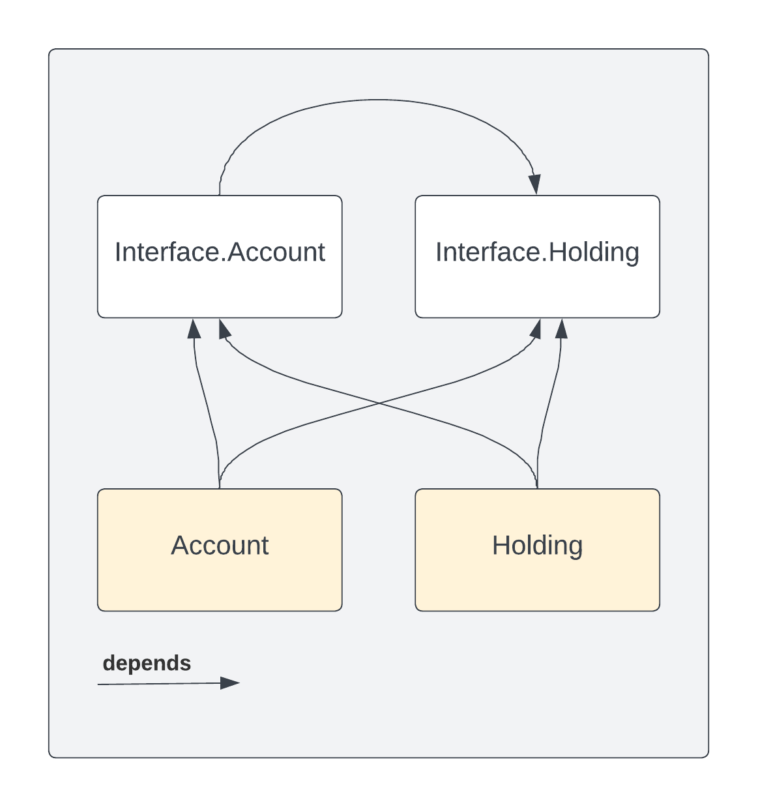

.. Copyright (c) 2024 Digital Asset (Switzerland) GmbH and/or its affiliates. All rights reserved.
.. SPDX-License-Identifier: Apache-2.0

Upgrade
#######

This section delves into the processes for upgrading existing contract instances on a Daml ledger.
A thorough understanding of the different types of upgrades is essential to choose the most suitable
method for various scenarios.

Upgrades are broadly classified into two categories:

* *Voluntary Upgrades:*
  Voluntary upgrades are similar to an airline offering you the option to upgrade your ticket from
  economy to business class. The upgrade only happens if you take an action (typically involving
  making a payment).

* *Mandatory Upgrades:*
  In contrast, mandatory upgrades happen inevitably, regardless of your preference. A common example
  is the automatic updating of smartphone apps. They typically occur *lazily* the next time you use
  the app. This approach allows software providers to uniformly expand their offerings.

We offer the following tutorials to guide you through the upgrade process:

* :doc:`Account Upgrade Tutorial <account>`:
  This tutorial covers voluntary upgrades. It presents a scenario where a custodian enables clients
  to voluntarily upgrade their `Account` contracts to a newer version.

* :doc:`Holding Upgrade Tutorial <holding>`:
  Here, we walk you through a scenario where a custodian upgrades the
  :ref:`Transferable <module-daml-finance-holding-v4-transferable-38649>` holding
  implementation to a custom, enhanced version, and its
  :ref:`HoldingFactory <module-daml-finance-holding-v4-factory-50391>` accordingly. As a result,
  existing holding instances (of the :ref:`Transferable <holding-standards>` holding standard) will
  be automatically upgraded to the new version during the next transfer. This serves as a practical
  example of a mandatory upgrade carried out in a lazy manner.

Note that upgrades for ``Account`` and ``Holding`` instances can be carried out independently,
thanks to the intentional decoupling of their implementation packages in Daml Finance:

    implementation and interface packages.
  :width: 100%

Download the Code for the Tutorials
***********************************

As a prerequisite, make sure that the :doc:`Daml SDK <../../../getting-started/installation>` is
installed on your machine.

Open a terminal and run:

.. code-block:: shell

   daml new finance-upgrades --template=finance-upgrades

This creates a new folder with contents from our template. Navigate to the ``finance-upgrades``
folder and then run the following to download the required Daml Finance packages:

.. code-block:: shell

   ./get-dependencies.sh

or, if you are using Windows

.. code-block:: shell

   ./get-dependencies.bat

Finally, you can start Daml Studio to inspect the code and run the project's scripts:

.. code-block:: shell

   daml studio
