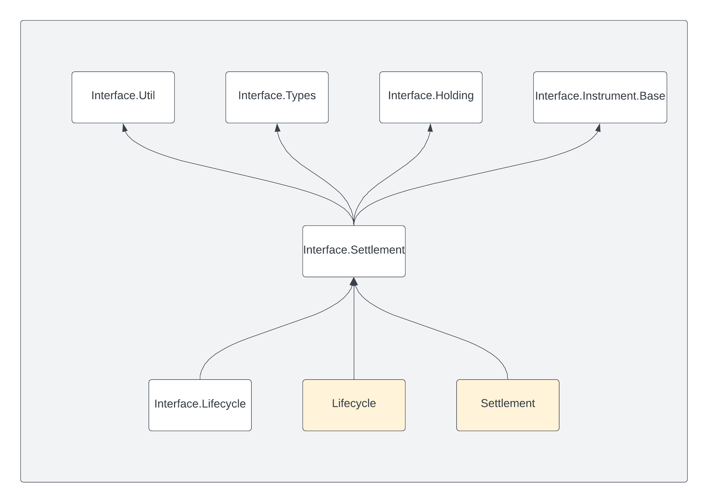

.. Copyright (c) 2024 Digital Asset (Switzerland) GmbH and/or its affiliates. All rights reserved.
.. SPDX-License-Identifier: Apache-2.0

Daml.Finance.Interface.Settlement.V4
####################################

This package contains the *interface* for settlement. It has the following modules:

- :ref:`RouteProvider <module-daml-finance-interface-settlement-v4-routeprovider-63>`:
  Interface for providing a discovery mechanism for settlement routes
- :ref:`Instruction <module-daml-finance-interface-settlement-v4-instruction-71097>`:
  Interface for providing a single instruction to transfer an asset at a custodian
- :ref:`Batch <module-daml-finance-interface-settlement-v4-batch-88127>`:
  Interface for atomically executing instructions, i.e., settling `Transferable`\s
- :ref:`Factory <module-daml-finance-interface-settlement-v4-factory-85379>`:
  Interface used to generate a batch and associated instructions
- :ref:`Types <module-daml-finance-interface-settlement-v4-types-65938>`:
  Types required in the settlement process, e.g., `Step`, `RoutedStep`, `Allocation`, and
  `Approval`

The :doc:`Settlement <../../concepts/settlement>` page contains an overview of the settlement
process and explains the relationship between instructions and batches. Check out the
:doc:`Settlement tutorial <../../tutorials/getting-started/settlement>` for a description on how to
use the settlement workflow in practice.

The following diagram shows the incoming and outgoing dependencies for this package:

Changelog
*********
