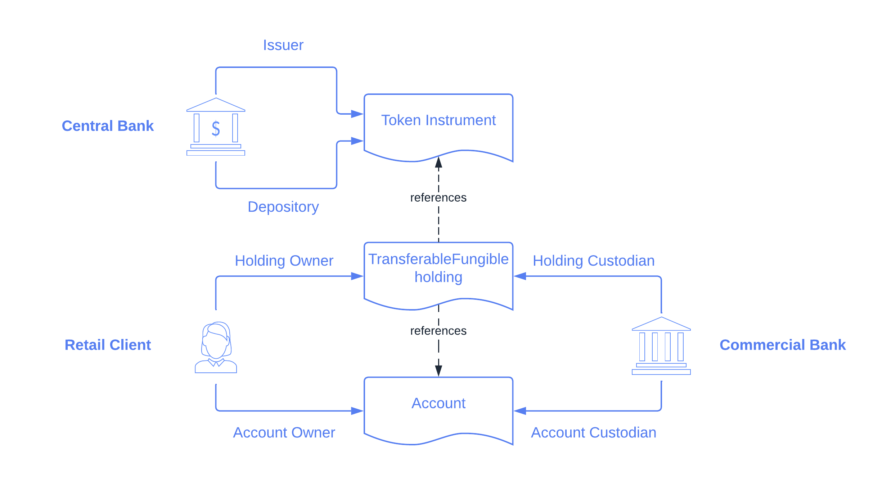

.. Copyright (c) 2022 Digital Asset (Switzerland) GmbH and/or its affiliates. All rights reserved.
.. SPDX-License-Identifier: Apache-2.0

Asset Model
###########

The library’s asset model is the set of contracts that describe the financial rights and obligations
that exist between parties. It is composed of instruments, holdings, and accounts.

Instrument
**********

An instrument contract describes the economic terms (rights and obligations) of one unit of a
financial contract.

It can be as simple as an ISIN code referencing some real-world (off-ledger) security, or it can
encode specific on-ledger lifecycling logic.

Signatories
===========

Every instrument must have an ``issuer`` party and a ``depository`` party, which are both
signatories of the contract.

The terminology is borrowed from the real world. For example, an issuer of a stock instrument
deposits the paper certificate at a depository and gets the corresponding amount credited in
book-entry form.

On the ledger, the ``depository`` acts as a trusted party that prevents the ``issuer`` from
potentially acting maliciously.

Keys and Versioning
===================

Instruments are keyed by an
:ref:`InstrumentKey <constr-daml-finance-interface-types-common-types-instrumentkey-32970>`,
which comprises:

- the instrument ``issuer``
- the instrument ``depository``
- a textual ``id``
- a textual ``version``

The version is used to keep track of the linear evolution of an instrument. For example, once a
dividend on a share is paid, the version is used to identify the cum-dividend and the ex-dividend
share.

Interfaces
==========

Instrument interfaces are defined in the ``Daml.Finance.Interface.Instrument.*`` packages.

All instruments must implement the base interface, defined in
:ref:`Daml.Finance.Interface.Instrument.Base <module-daml-finance-interface-instrument-base-instrument-57320>`.

Implementations
===============

A base implementation is provided in
:ref:`Daml.Finance.Instrument.Token <module-daml-finance-instrument-token-instrument-10682>`.

This template does not define any lifecycling logic and is suitable to model contracts that are
likely to stay stable, such as currency instruments.

The extension packages provide additional business-specific implementations, such as an
:ref:`Equity <module-daml-finance-instrument-equity-instrument-69265>`
instrument (where the issuer can pay dividends) or a
:ref:`Bond <module-daml-finance-instrument-bond-fixedrate-instrument-67993>`
instrument (which includes coupon payments).

The expectation is that customers define their own instruments suiting the use-case they are
modeling.

Holding
*******

A holding contract represents the ownership of a certain amount of an instrument by an owner at a
custodian.

Whereas an instrument defines *what* a party holds (the rights and obligations), a holding defines
*how much* (ie., the amount) of an instrument and *against which party* (ie., the custodian) the
instrument is being held.

It is important to understand that the economic terms of an asset (the instrument) are separated
from the representation of an asset holding. This allows centralized management of instruments (e.g.
lifecycling) and the reuse of instruments and associated logic across different entities (e.g.
custodians). It also avoids the data redundancy of replicating instrument data and logic on every
holding contract.

.. _signatories-1:

Signatories
===========

Every holding must have an ``owner`` party and a ``custodian`` party,
which are usually both signatories of the contract.

The terminology is again borrowed from the real world: our cash or shares are usually deposited at a
custodian and we have (at least in principle) the right to claim them back from the custodian at any
given time.

Properties of Holdings
======================

A holding implementation can have specific properties such as being :ref:`fungible <fungibility>` or
:ref:`transferable <transferability>`.

When, for instance, a holding is transferable, the ownership can be transferred to a different party
at the same custodian.

These properties are exposed by implementing the corresponding interface
(:ref:`Fungible <type-daml-finance-interface-holding-fungible-fungible-60176>` and
:ref:`Transferable <type-daml-finance-interface-holding-transferable-transferable-24986>`,
respectively).

.. _implementations-1:

Interfaces
==========

Holding interfaces are defined in the ``Daml.Finance.Interface.Holding`` package. These include a
:ref:`base holding interface <module-daml-finance-interface-holding-base-24195>`,
as well as interface definitions for the above properties.

Implementations
===============

Implementations are provided in ``Daml.Finance.Holding`` for:

- a :ref:`fungible and transferable <module-daml-finance-holding-fungible-7201>` holding
- a holding which is
  :ref:`transferable but not fungible <module-daml-finance-holding-nonfungible-86571>`
- a holding which is
  :ref:`neither transferable nor fungible <module-daml-finance-holding-nontransferable-44402>`

Account
*******

Account contracts are used as proof of a relationship between a ``custodian`` and an ``owner``.

An ``owner`` must have an account contract with a ``custodian`` before a holding contract can be
created between the two parties.

This is similar to how, in the real world, you need to open a bank account before you can use the
bank’s services.

The account contract also controls which parties are authorized to transfer holdings in and out of
the account. To be more precise, the
:ref:`controllers <type-daml-finance-interface-account-account-controllers-36430>`
field of the account contains:

- ``outgoing``: a set of parties authorizing outgoing transfers
- ``incoming``: a set of parties authorizing incoming transfers

This allows for modeling various controllers of transfers between Alice's and Bob's accounts. For
example:

- owners-controlled: If the ``owner`` is the sole member the ``outgoing`` and ``incoming``
  controllers for the accounts, a transfer of a holding from Alice's account to Bob's account needs
  to be authorized jointly by Alice and Bob.
- owner-only-controlled: If, instead, there are no ``incoming`` controllers of Bob's account,
  it is enough that Alice authorizes the transfer alone.
- custodian-controlled: If, as often is the case, the ``custodian`` needs to control what is being
  transferred, we can instead let the ``custodian`` be the sole member of ``outgoing`` and
  ``incoming`` controllers of the accounts.

Accounts also serve to prevent holding transfers to unvetted third parties: a holding of Alice can
only be transferred to Bob if Bob has an account at the same Bank (and has therefore been vetted by
the Bank).

.. _signatories-2:

Signatories
===========

An account is co-signed by the account ``owner`` and the ``custodian``.

Keys
====

Accounts are keyed by an
:ref:`AccountKey <type-daml-finance-interface-types-common-types-accountkey-41482>`, which comprises:

- the account ``owner``
- the account ``custodian``
- a textual ``id``

.. _implementations-2:

Interfaces
==========

The account interface is defined in the
:ref:`Daml.Finance.Interface.Account <module-daml-finance-interface-account-account-92922>`
package.

Implementations
===============

A base account implementation is provided in
:ref:`Daml.Finance.Account <module-daml-finance-account-account-19369>`.

The account can be created with arbitrary
:ref:`controllers <type-daml-finance-interface-account-account-controllers-36430>`
(for incoming and outgoing transfers).

In our examples, we typically let accounts be owners-controlled, i.e., both the current owner and
the new owner must authorize transfers.

Examples
********

We can now look at a few examples of how real-world rights and obligations can be modeled using the
Daml Finance asset model.

Currency
========

We start by modeling a standard cash bank account. There are three parties involved: a Central Bank,
a Commercial Bank, and a Retail Client.

The Central Bank defines the economic terms of the currency asset and is generally a highly trusted
entity, therefore it acts as ``issuer`` as well as ``depository`` of the corresponding instrument.

We can use the :ref:`Token <type-daml-finance-instrument-token-instrument-instrument-62305>`
instrument implementation for a currency asset, as we do not need any lifecycling logic.

The Retail Client has an
:ref:`Account <module-daml-finance-interface-account-account-92922>` at the Commercial Bank, with
the former acting as ``owner`` and the latter as ``custodian``.

Finally, the Retail Client is ``owner`` of a
:ref:`fungible holding <type-daml-finance-holding-fungible-fungible-28517>` at the Commercial Bank
(the ``custodian`` in the contract). The holding references the currency instrument, as well as the
account.

In this scenario, we can see how:

- the instrument defines what is held
- the holding defines where the rights and obligations lie, as well as the corresponding amount

Equity
======

We now model units of shares held by an investor. There are three parties involved: an Issuing
Entity, a Securities Depository, and an Investor.

The Issuing Entity acts as ``issuer`` of the :ref:`Equity Instrument
<type-daml-finance-instrument-equity-instrument-instrument-90430>`. The Securities Depository acts
as ``depository`` of the instrument, thus preventing the Issuing Entity from single-handledly
modifying details of the instrument (such as the share's nominal value).

The Institutional Investor holds units of shares against the Securities Depository, through
corresponding Account and Holding contracts.

.. image:: ../images/asset_model_stock.png
   :alt: Equity asset setup.

It is worth noting that the ``issuer`` of the Equity Instrument has the right to perform certain
Corporate Actions, such as declaring dividends. This topic is covered in the
:doc:`lifecycling section <lifecycling>`.

.. _otc-swap-asset-model:

OTC Swap
========

Finally, we model an OTC (over-the-counter) fixed vs. floating interest rate swap agreement between
two parties, namely Party A and Party B. We can use the :ref:`Interest Rate Swap
<type-daml-finance-instrument-swap-interestrate-instrument-instrument-52927>` instrument template
for this purpose.

In this case, all contracts are agreed and co-signed by both parties. In the instrument contract,
it does not really matter whether Party A is the ``issuer`` and Party B the ``depository``, or the
other way around. However, the role matters in the Holding contract, as it defines the direction of
the trade, i.e., which party receives the fixed leg and which party receives the floating one.

.. image:: ../images/asset_model_otc.png
   :alt: OTC Swap asset setup.
