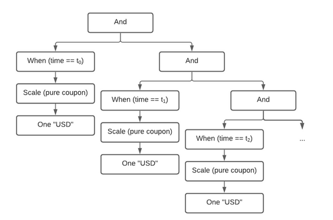

.. Copyright (c) 2023 Digital Asset (Switzerland) GmbH and/or its affiliates. All rights reserved.
.. SPDX-License-Identifier: Apache-2.0

Contingent Claims
#################

Introduction
************

Contingent Claims is a library for modeling financial instruments in Daml. An instrument is
represented by a tree of :ref:`Claims <type-contingentclaims-core-internal-claim-claim-35538>`,
which describe future cashflows between two parties as well as the conditions under which these
cashflows occur.

:ref:`ContingentClaims.Lifecycle <module-contingentclaims-lifecycle-lifecycle-72039>`
offers lifecycling capabilities, as well as a valuation semantics to map a claim to a mathematical
expression that can be used for no-arbitrage pricing.

An example of how to create and lifecycle contracts using Contingent Claims can be found in
:doc:`this tutorial <../tutorials/instrument-modeling/contingent-claims-instrument>`.

In the following we present a user guide for getting started with ``Contingent Claims``-based
modeling. It is meant to teach the basics of the framework, but does not cover every aspect. The
work is based on the papers [Cit1]_ and [Cit2]_, and we recommend that you refer to these for an
in-depth understanding of how it works.

The Model
*********

The approach taken in the papers is to model financial instruments by their cashflows. This should
be familiar to anyone having taken a course in corporate finance or valuation. Let’s start with an
example:

.. image:: ../images/contingent_claims_cashflows.png
   :alt: Image showing cashflows along a time axis. There are five arrow depicting smaller
         cashflows, and one final arrow representing a larger (redemption) payment.

The picture above represents the cashflows of a fixed-rate bond. Or alternatively, you can think of
it as a mortgage, from the point of view of the bank: there are interest payments at regular
intervals (the small arrows), and a single repayment of the loan at maturity (the big arrow on the
right). So how do we go about modelling this?

We use the following data type, slightly simplified from
:ref:`Claim <type-contingentclaims-core-internal-claim-claim-35538>`:

.. code-block:: daml

   data Claim a
    = zero
    | one a
    | give (Claim a)
    | and with lhs: Claim a, rhs: Claim a
    | or with lhs: Claim a, rhs: Claim a
    | scale with k: Date -> Decimal, claim: Claim a
    | when with predicate: Date -> Bool, claim: Claim a
    | anytime with predicate : Date -> Bool, claim: Claim a
    | until with predicate : Date -> Bool, claim: Claim a

There are a couple of things to consider.

First note that the constructors of this data type create a tree structure. The leaf constructors
are ``zero`` and ``one a``, and the other constructors create branches (observe they call
``Claim a`` recursively). The constructors are just functions, and can be combined to produce
complex cashflows. For example, to represent the above bond, we could write the following:

.. code-block:: shell

   when (time == t_0) (scale (pure coupon) (one “USD”)) `and` ...

Let’s look at the constructors used in the above expression in more detail:

- ``one "USD"`` means that the acquirer of the contract receives one unit of the asset, parametrised
  by ``a``, *immediately*. In this case we use a 3-letter ISO code to represent a currency, but you
  can use your own type to represent any asset.
- ``scale (pure coupon)`` modifies the *magnitude* of the arrow in the diagram. For example, in the
  diagram, the big arrow would have a distinct scale factor from the small arrows. In our example,
  the scale factor is constant: ``pure coupon = const coupon``, however, it’s possible to have a
  scale factor that depends on an unobserved value, such as a stock price, the weather, or any
  other measurable quantity.
- ``when (time == t_0)`` tells us where along the x-axis the arrow is placed, i.e., it modifies the
  point in time when the claim is acquired. The convention is that this must be the first instant
  that the predicate (``time == t_0`` in this case) is true. In our example it is a point, but
  again, we could have used an expression with an unknown quantity, for example
  ``spotPrice > pure k``, and it would trigger *the first instant* that the expression becomes
  true.
- ``and`` is used to chain multiple expressions together. Remember that in the ``data`` definition
  above, each constructor is a function: ``and : Claim a -> Claim a -> Claim a``. We use the Daml
  backtick syntax to write ``and`` as an infix operator, for legibility.

Additionally, there are several constructors which were not used in the above example:

- ``zero``, used to indicate an absence of obligations. While it may not make sense to create a
  ``zero`` claim, it could, for example, result from applying a function on a tree of claims.
- ``give`` would flip the direction of the arrows in our diagram. For example, in a swap we could
  use ``give`` to distinguish the received/paid legs.
- ``or`` is used to give the bearer the right to choose between two different claims. This is
  typically used for options.
- ``anytime`` is like ``when``, except it allows the bearer to choose (vs. no choice) acquisition
  within a region (or timeframe), vs. a specific point in time.
- ``until`` is used to adjust the expiration (*horizon* in [Cit1]_) of a claim. Typically, it is
  used with ``anytime`` to limit aforesaid acquisition region.

The tree produced by our expression (corresponding to the cashflow figure above) looks like this:



Composition and Extensibility
*****************************

Although we could model every subsequent arrow the way we did the first one, as good programmers we
wish to avoid repeating ourselves. Hence, we could write functions to re-use subexpressions of the
tree. But which parts should we factor out? It turns out that Finance 101 comes to the rescue
again. Fixed income practitioners will typically model a fixed-rate bond as a sum of zero-coupon
bonds. That’s how we model them in :ref:`Claims.Util.Builders
<module-daml-finance-claims-util-builders-48637>`. Below are slightly simplified versions:

.. code:: daml

   zcb maturity principal asset =
    when (time == maturity) (scale (O.pure principal) (one asset))

Here we’ve just wrapped our expression from the previous section in a function ``zcb``, that we can
reuse to build a ``fixed``-rate bond:

.. code:: daml

   fixed : Decimal -> Decimal -> a -> [Date] -> Claim a
   fixed principal coupon asset [] = zero
   fixed principal coupon asset [maturity] =
     zcb maturity coupon asset `and` zcb maturity principal asset
   fixed principal coupon asset (t :: ts) =
     zcb t coupon asset `and` fixed principal coupon asset ts

We define the fixed rate bond by induction, iterating over a list of dates ``[t]``, and producing
multiple zero-coupon bonds ``zcb`` combined together with ``and``:

-  The first definition covers the trivial case where we pass an empty list of dates.
-  The second definition handles the base case, at maturity: we create both a coupon (interest)
   payment, and the principal payment.
-  The third definition is the induction step; it peels the first element off the list, and calls
   itself recursively on the tail of the list, until it reaches the base case at maturity.

This re-use of code is prevalent throughout the library. It’s great as it mirrors how instruments
are defined in the industry. Let’s look at yet another example, a fixed vs floating USD/EUR swap.

.. code:: daml

   type Ccy = Text
   usdVsEur : [Date] -> Claim Ccy
   usdVsEur =
      fixed 100.0 0.1 "USD" `swap` floating (spot "EURUSD" * pure 100.0) (spot "EURUSD") "EUR"

We define it in terms of its two legs, ``fixed`` and ``floating``, which themselves are functions.
We use ``swap`` in infix form, and partially apply it - it takes a final ``[Date]`` argument which
we omit, hence the resulting signature ``[Date] -> Claim Ccy``.

As you can see, not only is this approach highly composable, but it also mirrors the way derivative
instruments are modelled in finance.

Another major advantage of this approach is its extensibility. Unlike a traditional approach, where
we might in an object-oriented language represent different instruments as classes, in the cashflow
approach, we do not need to enumerate possible asset classes/instruments *a priori*. This is
especially relevant in a distributed setting, where parties must execute the same code, i.e., have
the same ``*.dar``\ s on their ledger to interact. In other words, party A can issue a new
instrument, or even write a new combinator function that is in a private ``*.dar``, while being able
to trade with party B, who has no knowledge of this new ``*.dar``.

Concerning Type Parameters
**************************

The curious reader may have noticed that the signature we gave for ``data Claim`` is not quite what
is in the library, where we have ``data Claim t x a o``. In our examples, we have specialised this
to ``type Claim' t x a o = Claim Date Decimal a a``. Parametrising these variables allows us to
reason about ``Asset``\ s and ``Observation``\ s that appear in\ ``Claim``\ s as function-like
objects. The main use of this is to create claims with ‘placeholders’ for actual parameters, that
can later be ‘filled in’ by mapping over them (``mapParams``).

The Time Parameter
==================

``t`` is used to represent the first input argument to an ``Observation``, and above we used
``Date`` for this purpose. One reason this has been left parametrised is to be able to distinguish
different calendar and day count conventions at the type level. This is quite a technical topic, but
it suffices to know that for financial calculations, interest is not always accrued the same way,
nor is settlement possible every day, as this depends on local jurisdictions or market conventions.
Having different types makes this explicit at the instrument level.

Another use for this is expressing time as an ordinal values, representing e.g. days from issue.
Such a ``Claim`` can be used repeatedly to represent instruments issued at different dates, but with
the same durations.
For example, consider a series of listed futures or options which are issued with quarterly/monthly
maturities - their duration is about the same, but they are issued on different dates.

The Asset Parameter
===================

``a``, as we already explained, is the type used to represent assets in your application. Keeping
this generic means the library can be used with any asset representation. For example, you could use
one of the instrument implementations in Daml Finance, but are not forced to do so.

The Observation Parameter
=========================

``o`` is the type used to represent ``Observation``\ s, which are time-dependent quantities that can
be observed at any given time (such as the “EURUSD” exchange rate in the example above).

The Value Parameter
===================

``x`` is the ‘output’ type of an ``Observation``, but it can also serve as input when defining a
constant observation using, e.g., ``Observation.pure 10.08``.

Lifecycling
***********

So far we’ve learned how to model arbitrary financial instruments by representing them as trees of
cashflows. We’ve seen that these trees can be constructed using the type constructors of
``data Claim``, and that they can be factored into more complex building blocks using function
composition. But now that we have these trees, what can we do with them?

The original paper [Cit1]_ focuses on using these trees for valuing the instruments they represent,
i.e., finding the ‘fair price’ that one should pay for these cashflows. Instead, we’ll focus here on
a different use case: the lifecycling (aka safekeeping, processing corporate actions) of these
instruments.

Let’s go back to our fixed-rate bond example, above. We want to process the coupon payments. There
is a function in ```Lifecycle.daml`` <./daml/ContingentClaims/Lifecycle.daml>`__ for doing just
this:

.. literalinclude:: ../../../src/main/daml/ContingentClaims/Lifecycle/Lifecycle.daml
  :language: daml
  :start-after: -- CLAIMS_LIFECYCLE_BEGIN
  :end-before: -- CLAIMS_LIFECYCLE_END

This may look daunting, but let’s look at an example in
```ContingentClaims/Test/FinancialContract.daml``
to see this in action:

.. literalinclude:: ../../../src/test/daml/ContingentClaims/Test/FinancialContract.daml
  :language: daml
  :start-after: -- CLAIMS_LIFECYCLE_TEST_BEGIN
  :end-before: -- CLAIMS_LIFECYCLE_TEST_END

The first argument to lifecycle, ``getSpotRate``, is a function taking an ISIN (security) code, and
today’s date. All this does is fetch a contract from the ledger that is keyed by these two values,
and extract the price of the security.

The last two arguments are simply the claims we wish to process, and today’s date, evaluated using
``getTime``.

The return value, ``lifecycleResult``, will contain both the remaining tree after lifecycling, and
any assets that need to be settled. In our running bond example, we would extract the ``coupon``
from the first payment, and return it, along with the rest of the tree, after that branch has been
pruned (depicted greyed-out below):


You may wonder why we’ve separated the settlement procedure from the lifecycling function. The
reason is that we can’t assume that settlement will happen on-chain; if it does, that is great, as
we can embed this call into a template choice, and lifecycle and settle atomically. However, in the
case where settlement must happen off-chain, there’s no way to to do this in one step. This design
supports both choices.

Pricing (Experimental)
**********************

This is an *experimental* feature. Expect breaking changes.

The :ref:`ContigentClaims.Valuation.Stochastic <module-contingentclaims-valuation-stochastic-37844>`
module can be used for valuation. There is a ``fapf``
function which is used to derive a *fundamental asset pricing formula* for an arbitrary ``Claim``
tree. The resulting AST is represented by ``Expr``, but can be rendered as XML/MathML with the
provided ``MathML.presentation`` function, for display in a web browser. See the ``Test/Pricing``
module for examples. Here is a sample rendering of a margrabe option:

.. code:: html

   <math display="block"><msub><mi>USD</mi><mi>t</mi></msub><mo>⁢</mo><mo>𝔼</mo><mo>⁡</mo><mrow><mo fence="true">[</mo><mrow><mo fence="true">(</mo><msub><mo>I</mo><mrow><msub><mi>AMZN</mi><mi>T</mi></msub><mo>-</mo><msub><mi>APPL</mi><mi>T</mi></msub><mo>≤</mo><mn>0.0</mn></mrow></msub><mo>⁢</mo><mrow><mo fence="true">(</mo><msub><mi>AMZN</mi><mi>T</mi></msub><mo>-</mo><msub><mi>APPL</mi><mi>T</mi></msub><mo fence="true">)</mo></mrow><mo>+</mo><msub><mo>I</mo><mrow><mn>0.0</mn><mo>≤</mo><msub><mi>AMZN</mi><mi>T</mi></msub><mo>-</mo><msub><mi>APPL</mi><mi>T</mi></msub></mrow></msub><mo>×</mo><mn>0.0</mn><mo fence="true">)</mo></mrow><mo>⁢</mo><msup><mrow><msub><mi>USD</mi><mi>T</mi></msub></mrow><mrow><mo>-</mo><mn>1.0</mn></mrow></msup><mo>|</mo><msub><mo mathvariant="script">F</mo><mi>t</mi></msub><mo fence="true">]</mo></mrow></math>

You can cut-and-paste this into a web page in ‘developer mode’ in any modern browser.

References
**********

.. [Cit1] Jones, S. Peyton, Jean-Marc Eber, and Julian Seward. “Composing contracts: an adventure in
   financial engineering.” ACM SIG-PLAN Notices 35.9 (2000): 280-292.

.. [Cit2] Jones, SL Peyton, and J. M. Eber. “How to write a financial contract”, volume “Fun Of
   Programming” of “Cornerstones of Computing.” (2005).

The papers can be downloaded from
`Microsoft Research <https://www.microsoft.com/en-us/research/publication/composing-contracts-an-adventure-in-financial-engineering/>`__.
