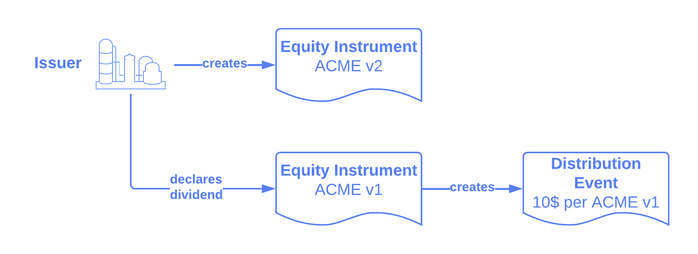
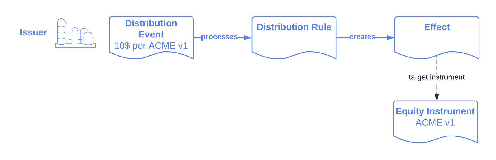
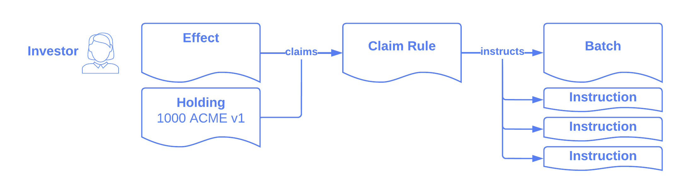
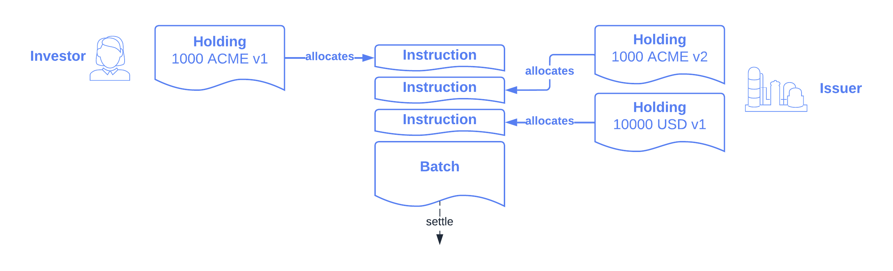

.. Copyright (c) 2023 Digital Asset (Switzerland) GmbH and/or its affiliates. All rights reserved.
.. SPDX-License-Identifier: Apache-2.0

Lifecycling
###########

:ref:`Lifecycling <lifecycling>` refers to the evolution of financial instruments over their
lifetime. This includes processing of contractual events, like interest payments or coupon
cashflows, as well as discretionary events, like dividends and other corporate actions. The library
provides a standard mechanism for processing such events accross different instruments.

The interfaces for lifecycling are defined in the ``Daml.Finance.Interface.Lifecycle`` package, and
several default implementations are provided in the ``Daml.Finance.Lifecycle`` package.

In this section, we first motivate the particular approach to lifecycling in Daml Finance. We then
explain the process in detail using the example of a cash dividend event. Finally, we describe each
of the involved components in depth.

Approach
********

Single Source of Truth
======================

A general principle we follow in Daml Finance is that there should only be a single instance of any
given instrument on the ledger. This instance is centrally maintained by the issuer of the
instrument, with the possibility for a depository to act as an additional, third-party trust anchor.
As part of lifecycling, this single instance of the instrument produces lifecycle effects, which are
then used across all parties on the ledger as a single source of truth for how to process a certain
event. This avoids any duplication of lifecycling logic or redundant processing of instruments, and
therefore removes the need for reconciliation across parties involved in the process.

Instrument Versioning
=====================

In current financial markets instruments are usually referenced by a textual identifier, like an
ISIN or CUSIP number. When a particular corporate action is processed on its effective date the
instrument referred to by an identifier changes implicitly. As an example, the ISIN for a stock
refers to the "cum-dividend" instrument (where holders are still entitled to the dividend) up until
the ex-dividend date. From the ex-dividend date onwards the same ISIN refers to the "ex-dividend"
instrument, so any stock acquired on or after that date is not entitled to the dividend anymore.
This leads to a lot of complexity during processing of such corporate actions. In particular, it
forces these events to be processed in a "big bang" approach, as a consistent snapshot of holdings
needs to be taken to determine the rightful recipients of any resulting cashflows.

In Daml Finance we aim for a more efficient and flexible operating model for processing lifecycle
events. All instruments are strictly versioned so that we can clearly differentiate between the
cum- and ex-event version of an instrument. This means that it is perfectly safe for those versions
to co-exist at the same time, and it allows for a gradual transition from one version to another.
Generally, the issuer of an instrument is responsible for creating and maintaining instrument
versions, and for producing the cashflow effects of a particular lifecycle event. During the
lifecycle process, holders of this instrument will migrate their holdings to a new version of the
instrument while at the same time claiming any resulting cashflows from the event.

Versions are usually considered opaque strings, but one can follow a numerical versioning scheme if
an instrument is known to have linear evolution (i.e., there is no optionality that can result in
two different evolution paths).

Workflow
********

In this scenario we go through the process of paying a cash dividend from an issuer to an investor.
The initial state looks as follows:

* An issuer maintains an ``ACME`` instrument representing shares in a company
* An investor owns a holding of 1000 units of the ``ACME`` instrument (version 1) with the issuer
* The issuer wants to process and pay a cash dividend of USD 10.0 per unit of its ``ACME``
  instrument (version 1)

.. image:: ../images/lifecycle_initial_state.png
   :alt: The issuer issues the ACME instrument. The investor owns a holding of 1000 ACME shares
         (version 1). The holding references the instrument.

We will now explain each step in the process in detail.

Creating the event
==================

The issuer first creates a new instance of the ``ACME`` instrument, assiging a new version. Note
that the logic to create the new version of an instrument can also be encoded in the lifecycle rule.
The new version is then automatically produced when processing the event as described in the next
step.

Now, the issuer creates a lifecycle event defining the terms of dividend. In our example we can
use the ``DistributeDividend`` choice on the
:ref:`Equity <type-daml-finance-interface-instrument-equity-instrument-instrument-99859>` instrument
to create such an event. This is merely a convenience choice available for equities, any workflow
can be used to create new instrument versions and associated lifecycle events.

         event by declaring a dividend on the ACME v1 instrument.

Processing the event
=====================

The event is now passed into a
:ref:`Distribution Rule <type-daml-finance-lifecycle-rule-distribution-rule-66267>`, which
generates the :ref:`Lifecycle Effect <type-daml-finance-interface-lifecycle-effect-effect-69649>`
describing the distribution of assets per unit of ``ACME`` stock. The effect refers to a
``targetInstrument``, which is the version of the instrument that can be used by stock holders to
claim the cash dividend according to the number of stocks held. By being tied to a specific version
we prevent holders from (accidentally or intentionally) claiming a particular effect twice.

         lifecycle effect. The effect references ACME v1 as a target instrument.

Claiming the effect
===================

The investor can now present its holding of ``ACME`` stock along with the corresponding
:ref:`Effect <type-daml-finance-interface-lifecycle-effect-effect-69649>` to a
:ref:`Claim Rule <type-daml-finance-interface-lifecycle-rule-claim-claim-29284>`. This will
instruct settlement for:

- The exchange of ``ACME`` stock versions held: the investor sends back the old version, and
  receives the new one
- The payment of the cash dividend amount corresponding to the number of stocks held

Both legs of this settlement are grouped in a
:ref:`Batch <type-daml-finance-interface-settlement-batch-batch-97497>` to provide atomicity. This
ensures that the investor can never claim a dividend twice, as after settlement they only hold the
new version of the stock, which is not entitled to the dividend anymore.

         holding. This produces a batch and settlement instructions.

Note that the party responsible for claiming an effect can be specified flexibly in the
:ref:`Claim Rule <type-daml-finance-interface-lifecycle-rule-claim-claim-29284>` contract. Through
this contract, custodians can be given the authority to push a given corporate action to the asset
holder as is common in current operating procedures.

The model also supports atomic, intermediated settlement of lifecycle events. For example, if a
dividend is to be settled between issuer, custodian, and investor in a single transaction, the
custodian (having visibility of both its holding at the issuer and the investor's holding) can
pass in both holdings into the claim rule, and thereby instruct a single batch to settle both
sides.

Settlement
==========

The batch and instructions resulting from claiming an effect can now be settled as described in the
:doc:`Settlement <settlement>` section of the documentation.

The following picture shows the three asset movements involved in this particular example:

         allocates a 1000 ACME v2 holding to the second instruction and a 10000 USD holding to the
         third.

The result of processing the settlement batch results in the investor receiving a 10000 USD
dividend and 1000 shares of ``ACME`` v2 in return for their 1000 shares of ``ACME`` v1.

Components
**********

Events
======

The :ref:`Event <type-daml-finance-interface-lifecycle-event-event-2931>` interface describes basic
properties of a lifecycle event:

- The event providers
- The event identifier and description
- The event timestamp

Different implementations exist to cover typical event types:

- The :ref:`Distribution <type-daml-finance-lifecycle-event-distribution-event-46459>` event can be
  used to distribute assets to holders of an instrument. This covers cash-, share-, and mixed
  dividends, rights issues, or the distribution of voting rights.
- The :ref:`Replacement <type-daml-finance-lifecycle-event-replacement-event-16120>` event handles
  replacements of one instrument for another with support for a factor. This covers corporate
  actions like (reverse) stock splits, mergers, and spin-offs.

Lifecycle Rule
==============

The :ref:`Lifecycle Rule <type-daml-finance-interface-lifecycle-rule-lifecycle-lifecycle-97652>` is
used to process an event and calculate the resulting lifecycle effect. A lifecycle rule can either
assume that a new version of the instrument has already been created (as is the case for the
:ref:`Distribution <type-daml-finance-lifecycle-rule-distribution-rule-66267>` and
:ref:`Replacement <type-daml-finance-lifecycle-rule-replacement-rule-7648>` rules), or it can create
the new version of the instrument as part of its implementation. The latter can be useful if
information required to create the new version is only available upon processing of the event, as is
the case for :ref:`Generic Instrument
<type-daml-finance-interface-instrument-generic-instrument-instrument-11652>` evolution.

Claim Rule
==========

The :ref:`Claim Rule <type-daml-finance-interface-lifecycle-rule-claim-claim-29284>` is used to
claim lifecycle effects and instruct settlement thereof. Each effect specifies a target instrument
(and version), and holdings on this instrument (version) are required to claim an effect. This
serves as proof of ownership such that there is no need for an issuer to take a consistent snapshot
of holdings as of a specific date.

The output of the claim rule is a
:ref:`Batch <type-daml-finance-interface-settlement-batch-batch-97497>` and a set of
:ref:`Instruction <type-daml-finance-interface-settlement-instruction-instruction-30569>` s forming
an atomic unit of settlement.

Note that multiple holdings can be passed into the claim rule in order to instruct intermediated
settlement of an effect, or to instruct atomic settlement for multiple asset holders at the same
time.

Effects
=======

An :ref:`Effect <type-daml-finance-interface-lifecycle-effect-effect-69649>` describes the asset
movements resulting from a particular event. It specifies these movements per unit of a target
instrument and version. Holdings on this specific instrument version entitle a holder to claim the
effect, which results in the required asset movements to be instructed.
