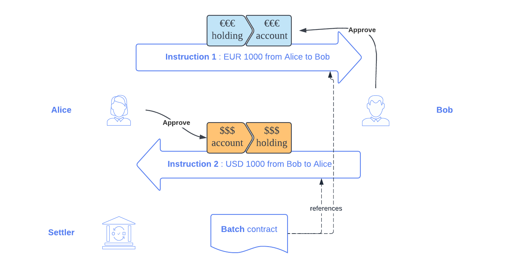
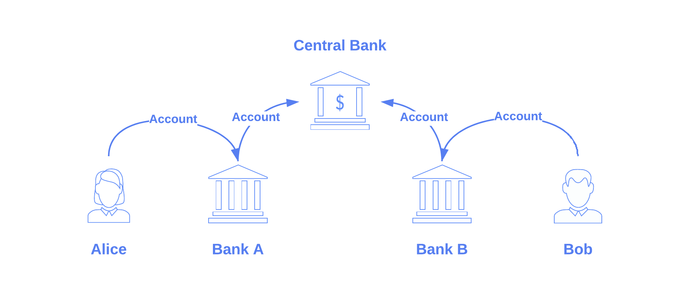

.. Copyright (c) 2022 Digital Asset (Switzerland) GmbH and/or its affiliates. All rights reserved.
.. SPDX-License-Identifier: Apache-2.0

Settlement
##########

:ref:`Settlement <settlement>` refers to the execution of holding transfers originating from a
financial transaction.

Daml Finance provides facilities to execute these transfers atomically (i.e., within the same Daml
transaction). Interfaces are defined in the ``Daml.Finance.Interface.Settlement`` package, whereas
implementations are provided in the ``Daml.Finance.Settlement`` package.

In this section, we first illustrate the settlement workflow with the help of an example FX
transaction, where Alice transfers a EUR-denominated holding to Bob, in exchange for a
USD-denominated holding of the same amount.

We then delve into the details of each of the settlement components.

Workflow
********

Our initial state looks as follows:

* Alice owns a holding on a ``EUR`` instrument, for an amount of ``1000``
* Bob owns a holding on a ``USD`` instrument, for an amount of ``1000``

.. image:: ../images/settlement_initial_state.png
   :alt: Alice owns a EUR holding, Bob owns a USD holding.

These holdings are generally held at different custodians.

Instruct
========

Alice and Bob want to exchange their holdings and agree to enter into the transaction by being
signatories on a transaction contract. Settlement can then be instructed which results in 3
contract instances being created:

#. an :ref:`Instruction <module-daml-finance-settlement-instruction-87187>`
   to transfer EUR 1000 from Alice to Bob
#. an :ref:`Instruction <module-daml-finance-settlement-instruction-87187>`
   to transfer USD 1000 from Bob to Alice
#. a :ref:`Batch <module-daml-finance-settlement-batch-95573>`
   used to execute the above Instructions

.. image:: ../images/settlement_instructed.png
   :alt: Settlement is instructed.

Each instruction defines who is the sender, who is the receiver, and what should be transferred
(instrument and amount) at which custodian.

Allocate and Approve
====================

In order to execute the FX transaction, we first need to:

- allocate, i.e., specify which holding should be used
- approve, i.e., specify to which account the asset should be transferred

Allocation and approval is required for
each :ref:`Instruction <module-daml-finance-settlement-instruction-87187>`.

Alice :ref:`allocates <module-daml-finance-interface-settlement-instruction-10970>` the instruction
where she is the sender by pledging her holding. Bob does the same on the instruction where he is
the sender.

Each receiver can then specify to which account the holding should be sent by
:ref:`approving <module-daml-finance-interface-settlement-instruction-10970>`
the corresponding instruction.

Execute
=======

Once both instructions are allocated and approved, a Settler party uses the
:ref:`Batch <module-daml-finance-settlement-batch-95573>` contract to
:ref:`execute <module-daml-finance-interface-settlement-instruction-10970>`
them and finalize settlement in one atomic transaction.

The instructions and the batch are archived following a successful execution.

Remarks
=======

There are some assumptions that need to hold in order for the settlement to work in practice:

- Bob needs to have an account at the custodian where Alice's holding is held and vice versa (for
  an example with intermediaries, see `Route provider`_ below.
- Both holdings need to be
  :ref:`Transferable <type-daml-finance-interface-holding-transferable-transferable-24986>`
- The transfer must be fully authorized (i.e., the parties allocating and approving an instruction
  must be the controllers of outgoing and incoming transfers of the corresponding accounts,
  respectively)

Also, note that the allocation and approval steps can happen in any order.

The components in detail
************************

Route provider
==============

When a transfer requires intermediaries to be involved, the role of a
:ref:`Route Provider <type-daml-finance-interface-settlement-routeprovider-routeprovider-53805>`
becomes important. Let us assume, for instance, that Alice's EUR holding in the example above is
held at Bank A, whereas Bob has a EUR account at Bank B. Bank A and Bank B both have accounts at the
Central Bank.

         Bank B. Bank A and Bank B have an account at the Central Bank.

In this case, a direct holding transfer from Alice to Bob cannot generally be instructed. The
original :ref:`Instruction <module-daml-finance-settlement-instruction-87187>`
between Alice and Bob needs to be replaced by three separate
:ref:`Instructions <module-daml-finance-settlement-instruction-87187>`:

- **1A**: Alice sends EUR 1000 (held at Bank A) to Bank A
- **1B**: Bank A sends EUR 1000 (held at the Central Bank) to Bank B.
- **1C**: Bank B credits EUR 1000 to Bob's account (held at Bank B)

.. image:: ../images/settlement_hierarchy_instructed.png
   :alt: Instructions for intermediated settlement: Alice sends EUR 1000 to Bank A. Bank A sends
         EUR 1000 to Bank B. Bank B sends EUR 1000 to Bob.

We refer to this scenario as *settlement with intermediaries*, or just *intermediated settlement*.

The Route Provider is used to discover a settlement route, i.e.,
:ref:`routed steps <type-daml-finance-interface-settlement-types-routedstep-10086>`, for each
settlement :ref:`step <type-daml-finance-interface-settlement-types-step-78661>`.

Settlement factory
==================

The :ref:`Settlement Factory <type-daml-finance-interface-settlement-factory-factory-31525>` is used
to instruct settlement, i.e., create the :ref:`Batch <module-daml-finance-settlement-batch-95573>`
contract and the settlement :ref:`Instructions <module-daml-finance-settlement-instruction-87187>`,
from :ref:`routed steps <type-daml-finance-interface-settlement-types-routedstep-10086>`, so that
they can be allocated and approved by the respective parties.

Instruction
===========

The :ref:`Instruction <type-daml-finance-interface-settlement-instruction-instruction-30569>` is
used to settle a single holding transfer at a specific custodian, once it is ``allocated`` and
``approved``.

In the :ref:`Allocation <type-daml-finance-interface-settlement-types-allocation-46483>` step, the
sender acknowledges the transfer and determines how to send the holding. This is usually done by
allocating with a :ref:`Pledge <constr-daml-finance-interface-settlement-types-pledge-99803>`
of the sender's existing holding (which has the correct instrument quantity) at the custodian. When
the sender is also the custodian, the instruction can be allocated with
:ref:`CreditReceiver <constr-daml-finance-interface-settlement-types-creditreceiver-50700>`. In this
case, a new holding is directly credited into the receiver's account.

In the :ref:`Approval <type-daml-finance-interface-settlement-types-approval-84286>` step, the
receiver acknowledges the transfer and determines how to receive the holding. This is usually done
by approving with
:ref:`TakeDelivery <constr-daml-finance-interface-settlement-types-takedelivery-14079>` to one of
the receiver's accounts at the custodian. When the receiver is also the incoming holding's
custodian, the instruction can be approved with
:ref:`DebitSender <constr-daml-finance-interface-settlement-types-debitsender-39086>`. In this case,
the holding is directly debited from the sender's account. A holding owned by the custodian at the
custodian has no economical value, it is a liability against themselves and can therefore be
archived without consequence.

To clarify these concepts, here is how the 3 instructions in the intermediated example above would
be allocated / approved.

+----------------------------------------------------+----------------------+----------------------+
| Instruction                                        | Allocation           | Approval             |
+====================================================+======================+======================+
| 1A : EUR 1000 from Alice to Bank A @ Bank A        | Alice pledges her    | Bank A approves      |
|                                                    | holding              | with DebitSender     |
+----------------------------------------------------+----------------------+----------------------+
| 1B : EUR 1000 from Bank A to Bank B @ Central Bank | Bank A pledges       | Bank B takes delivery|
|                                                    | its holding          | to its account       |
+----------------------------------------------------+----------------------+----------------------+
| 1C : EUR 1000 from Bank B to Bob @ Bank B          | Bank B allocates     | Bob takes delivery   |
|                                                    | with CreditReceiver  | to his account       |
+----------------------------------------------------+----------------------+----------------------+

Finally, the :ref:`Instruction <module-daml-finance-settlement-instruction-87187>` supports two
additional settlement modes:

- Any instruction can settle off-ledger (if the stakeholders agree to do so). For this to work, we
  require the custodian and the sender to jointly allocate the instruction with a
  :ref:`SettleOffledger <constr-daml-finance-interface-settlement-types-settleoffledger-15836>`,
  and the custodian and the receiver to jointly approve the instruction with a
  :ref:`SettleOffledgerAcknowledge
  <constr-daml-finance-interface-settlement-types-settleoffledgeracknowledge-98269>`.
- A special case occurs when a transfer happens via an intermediary at the same custodian, i.e., we
  have 2 instructions having the same custodian and instrument quantity (in a batch), and the
  receiver of the first instruction is the same as the sender of the second instruction. In this
  case, we allow the holding received from the first instruction to be passed through to settle the
  second instruction, i.e., without using any pre-existing holding of the intermediary. For this to
  work, the first instruction is approved with
  :ref:`PassThroughTo <constr-daml-finance-interface-settlement-types-passthroughto-68260>` (i.e.,
  pass through to the second instruction), and the second instruction is allocated with
  :ref:`PassThroughFrom <constr-daml-finance-interface-settlement-types-passthroughfrom-69429>`
  (i.e., pass through from the first instruction). An intermediary account used for the passthrough
  is thereby also to be specified.

Batch
=====

The :ref:`Batch <type-daml-finance-interface-settlement-batch-batch-97497>` is used to execute a set
of instructions atomically. Execution will fail if any of the
:ref:`Instructions <module-daml-finance-settlement-instruction-87187>` is not fully allocated
/ approved, or if the transfer is unsuccessful.

Remarks and further references
******************************

The settlement concepts are also explored in the
:doc:`Settlement tutorial <../tutorials/getting-started/settlement>`.
