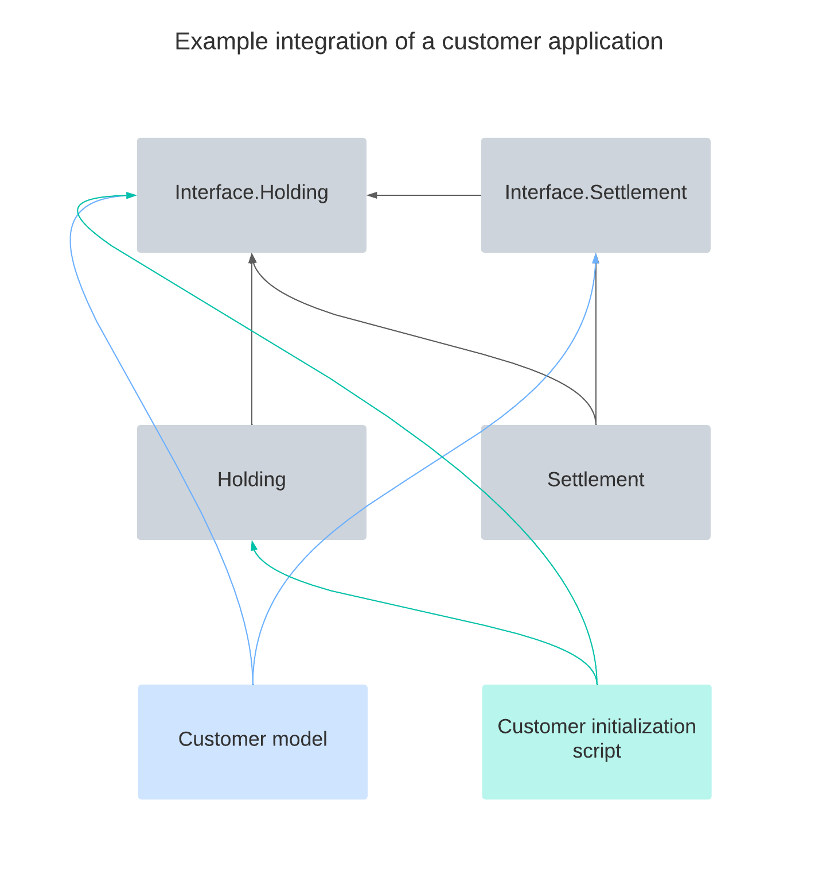

.. Copyright (c) 2022 Digital Asset (Switzerland) GmbH and/or its affiliates. All rights reserved.
.. SPDX-License-Identifier: Apache-2.0

Architecture
############

This page outlines the architecture of the library and the relationships
between the different packages.

Daml Finance consists of a set of ``.dar`` packages that can be divided
into two layers:

-  an *interface layer* representing its public, stable API
-  an *implementation layer* providing a set of standard template
   implementations

Each package in the implementation layer only depends on packages of the
interface layer.

Interface Layer
***************

The interface layer provides common type definitions and a set of Daml
interface definitions. These interfaces define the API that lets
implementation packages (containing concrete template definitions)
interact with each other.

This layer includes several Daml packages, each grouping related business
functions. These packages can in principle be used independently
from each other:

-  ``Daml.Finance.Interface.Holding`` defines interfaces for holdings,
   accounts, and holding properties such as :ref:`fungibility <fungibility>`,
   :ref:`transferability <transferability>`, or :ref:`locking <locking>`
-  ``Daml.Finance.Interface.Settlement`` defines interfaces for
   settlement instructions and batched settlements
-  ``Daml.Finance.Interface.Lifecycle`` defines interfaces used for
   instrument lifecycling
-  ``Daml.Finance.Interface.Instrument.*`` contains interfaces used for
   different instrument types
-  ``Daml.Finance.Interface.Claims`` contains interfaces used for
   contingent-claims based instrument types
-  ``Daml.Finance.Interface.Data`` defines interfaces related to reference
   data

In addition to the above, the ``Daml.Finance.Interface.Types`` package provides types and ``Daml.Finance.Interface.Util`` package defines utilities and interfaces used by other interface packages.

Implementation Layer
********************

The implementation layer defines concrete template definitions
implementing the interfaces defined in the interface layer. These are
the objects that are ultimately stored on the ledger.

For instance, ``Daml.Finance.Holding`` defines a concrete implementation
of a :ref:`transferable <transferability>`, :ref:`fungible <fungibility>` holding. This template implements
interfaces defined in ``Daml.Finance.Interface.Holding``.

The implementation layer consists of the following packages:

-  ``Daml.Finance.Holding`` defines default implementations for holdings,
   accounts and instruments
-  ``Daml.Finance.Settlement`` defines templates for settlement
   instructions and arbitrary batched settlements
-  ``Daml.Finance.Lifecycle`` defines an implementation of lifecycle
   effects and a rule template to facilitate their settlement
-  ``Daml.Finance.Instrument.*`` contains implementations for various
   instrument types
-  ``Daml.Finance.Data`` includes templates used to store reference
   data on the ledger. Reference data is typically used by the lifeycling
   functionality (e.g. holiday calendars and rate fixings)
-  ``Daml.Finance.Util`` package provides a set of pure utility functions
   mainly for date manipulation

How To Use the Library
**********************

Users are expected to build applications such that they only depend
on packages defined by the interface layer.

This ensures that patches and bug fixes can be rolled out through new
implementation packages and existing contracts stemming from those
packages can be upgraded without affecting the customer application.

There are cases, however, where a customer will have to depend on a
specific implementation package. This dependency should be minimized and (as much as possible) restricted to scripts that are executed
as part of an application initialization. In this context, a tight
coupling to an implementation is not problematic, as these are
considered one-time actions.

The image below depicts the dependency graph of an example customer
application using Daml Finance. The :doc:`Getting Started <../tutorials/getting-started/intro>` examples showcase this dependency pattern.

lement feeds into Interface.Asset and Interface.Settlement. Asset feeds into Interface.Asset. Interface.Settlement feeds into Interface.Asset. Interface.Asset does not have any outgoing arrows.

Extension Points
****************

Each of the provided interfaces allows a user to extend the library with custom functionality. The important extension points are:

-  *Holding interface hierarchy*: can be implemented to support specific requirements around fungibility (e.g. fixed divisibility), transferability (e.g. transfer restrictions), or just to hold additional information required on a holding contract
-  *Instrument interface*: can be implemented to support specific financial instruments and data models (e.g. a CDM-based instrument)
-  *Account interface*: can be implemented to support different account types (e.g. gold bars located at shelfs in vaults)
-  *Settlement interfaces*: can be implemented to support new settlement modes (e.g. involving off-ledger legs, or HTLC-type mechanisms)
-  *Lifecycle interfaces*: can be implemented to support new lifecycle events, or observation types
