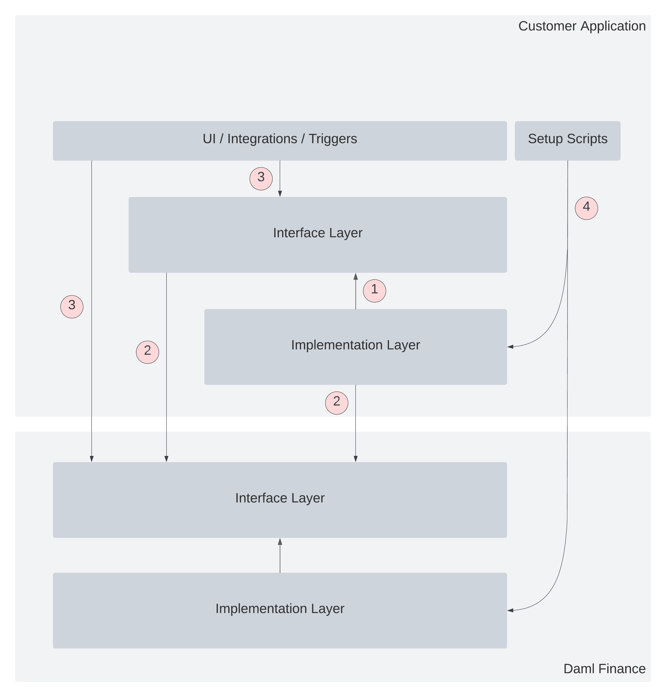

.. Copyright (c) 2023 Digital Asset (Switzerland) GmbH and/or its affiliates. All rights reserved.
.. SPDX-License-Identifier: Apache-2.0

Building Applications
#####################

This page describes the patterns to follow when building applications using Daml Finance.

Installing Daml Finance
***********************

Each Daml SDK release defines a set of consistent Daml Finance package versions that have been
tested to work with each other. The list of package versions for each Daml SDK release can be found
:ref:`here <releases>`. To facilitate getting started with a particular release set, the Daml SDK
comes with a ``quickstart-finance`` template that contains a script to download these packages.

After installing the Daml SDK, you can execute the following commands to create a new Daml Finance
project based on the set of packages released with the given SDK version:

On Unix-based systems execute:

.. code-block:: shell

   daml new quickstart-finance --template=quickstart-finance
   cd quickstart-finance
   ./get-dependencies.sh

On Windows-based systems execute:

.. code-block:: shell

   daml new quickstart-finance --template=quickstart-finance
   cd quickstart-finance
   get-dependencies.bat

You can then edit the ``daml.yaml`` file and uncomment the lines corresponding to the packages you
require in your project.

Alternatively, if you want to install the latest Daml Finance version into an existing project, you
can copy and execute these scripts
(`Unix <https://github.com/digital-asset/daml-finance/blob/main/docs/code-samples/getting-started/get-dependencies.sh>`_
and
`Windows <https://github.com/digital-asset/daml-finance/blob/main/docs/code-samples/getting-started/get-dependencies.bat>`_
variants) from the main branch of the repository.

Application Architecture
************************

When building applications using Daml Finance it is important to ensure your application only
depends on the interface layer (i.e., the public API) of Daml Finance. Furthermore, it is suggested
that your application follows a similar split between interface (API) and implementation layer in
order to maximize upgradability and minimize the impact of incremental changes to your application
or Daml Finance.

The following picture shows a suggested architecture that minimizes undesireable coupling and
optimizes for upgradability of your application:

         contain boxes separating an interface and implementation layer in each. The customer
         application interface and implementation boxes are annotated with the number 1. These boxes
         are connected to the Daml Finance interface layer through an arrow, annotated with the
         number 2. Another box in the Customer Application, containing "UI / Integrations /
         Triggers", is connected to the interface layers of the Customer Application and Daml
         Finance, annotated with the number 3. A box in the Customer Application containing "Setup
         Scripts" is connected to the implementation layers of the Customer Application and Daml
         Finance, annotated with the number 4.

The following annotations are highlighted in the diagram:

1. The customer application should be split into an implementation and an interface (API) layer.
   This ensures that implementations can be upgraded without affecting client-side applications,
   like the UI, integrations, or Daml Triggers.
2. The customer application (both the interface and implementation layer) should only depend on the
   interface layer (API) of Daml Finance. This ensures that upgrades to the implementation layer of
   Daml Finance do not affect the Customer Application.
3. All client-side code (UI, integrations, Daml Triggers, etc.) should only depend on the interface
   layers of Daml Finance and the Customer Application. This ensures that any implementation
   upgrades in Daml Finance or the Customer Application do not affect client-side code.
4. Any setup scripts used to initialize the application can (and usually have to) depend on the
   implementation layers of Daml Finance and the Customer Application. This is required to set up
   contracts like factories, where a dependency on the implementation package is needed. It does not
   affect the overall upgradability of the Customer Application as these operations are usually
   executed either at initial setup or on a one-off basis, but not during normal operation of the
   application.

Following the above patterns ensures minimal impact of changes to any implementation part of the
overall application:

- If a Daml Finance implementation package is upgraded, only the contracts for templates within the
  package have to be upgraded. The Customer Application itself is unaffected because it only depends
  on the interface packages, which remain unchanged.
- If a customer application implementation package is upgraded, only the contracts for templates
  within that package need to be upgraded. The client-side code of the application is unaffected, as
  it only depends on the Customer Application interface layer.
- If a Daml Finance interface package is upgraded, the affected parts in the customer application
  implementation, interface, or client-side layer need to be upgraded. To minimize the impact of
  such change it is suggested that the customer application layers themselves are divided into
  packages, that each depend on a minimal set of Daml Finance interface packages.
- If a customer application interface package is upgraded the corresponding implementation packages,
  as well as the affected client-side code have to be upgraded. Again, splitting up the interface
  (API) layer of the customer application can minimize the impact of such a change.

In general, we will provide upgrade contracts and scripts to facilitate migration between major
version updates of packages within the Daml Finance perimeter.
