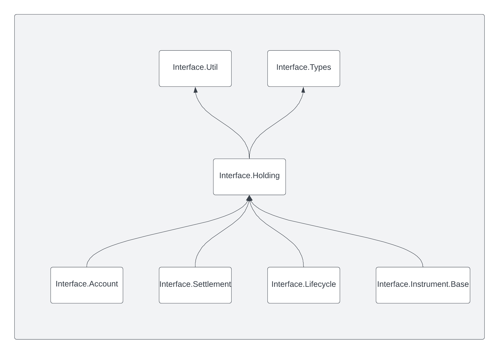

.. Copyright (c) 2024 Digital Asset (Switzerland) GmbH and/or its affiliates. All rights reserved.
.. SPDX-License-Identifier: Apache-2.0

Daml.Finance.Interface.Holding.V4
#################################

This package contains the *interface* and utility functions for holdings. It has the following
modules:

- :ref:`Factory <module-daml-finance-interface-holding-v4-factory-49942>`:
  Interface for a holding factory used to create (credit) and archive (debit) holdings
- :ref:`Holding <module-daml-finance-interface-holding-v4-holding-20535>`:
  Interface for a base holding which includes locking capabilities
- :ref:`Fungible <module-daml-finance-interface-holding-v4-fungible-55495>`:
  Interface for a fungible holding which allows splitting and merging
- :ref:`Transferable <module-daml-finance-interface-holding-v4-transferable-93054>`:
  Interface for a transferable holding, i.e., where ownership can be transferred to other parties
- :ref:`Util <module-daml-finance-interface-holding-v4-util-74545>`:
  Utility functions related to holdings, e.g., getting the amount or the instrument of a holding

The :doc:`Asset Model <../../concepts/asset-model>` page explains the relationship between
instruments, holdings, and accounts. Check out the
:doc:`Transfer tutorial <../../tutorials/getting-started/transfer>` for a description on how to
create a holding on an instrument and how to transfer it between accounts.

The following diagram shows the incoming and outgoing dependencies for this package:

Changelog
*********
