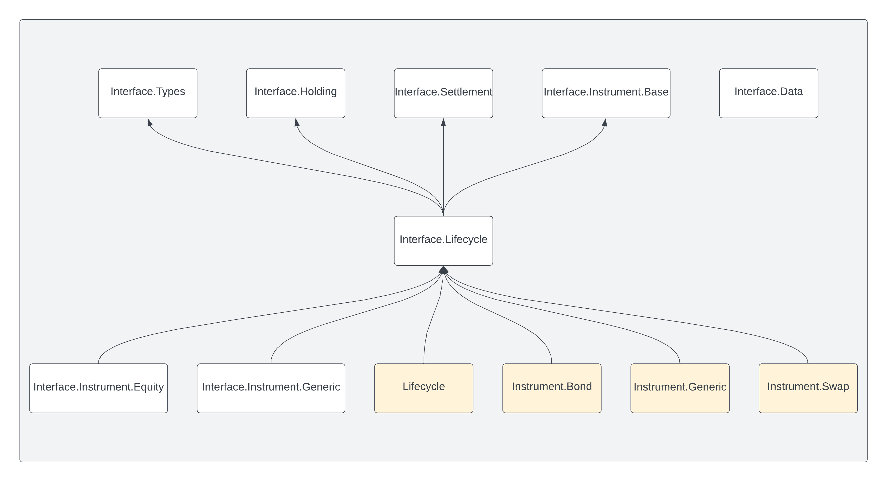

.. Copyright (c) 2023 Digital Asset (Switzerland) GmbH and/or its affiliates. All rights reserved.
.. SPDX-License-Identifier: Apache-2.0

Daml.Finance.Interface.Lifecycle
################################

This package contains the *interface* for lifecycle related processes. It contains the following
modules:

- :ref:`Effect <module-daml-finance-interface-lifecycle-effect-16050>`:
  Interface for contracts exposing effects of lifecycling processes, e.g., the payment resulting
  from a bond coupon
- :ref:`Event <module-daml-finance-interface-lifecycle-event-43586>`:
  Interface for a lifecycle event. An event is any contract that triggers the processing of a
  lifecycle rule. Events can be, e.g., dividend announcements or simply the passing of time.
- :ref:`Event.Distribution <module-daml-finance-interface-lifecycle-event-distribution-91943>`:
  Event interface for the distribution of units of an instrument for each unit of a target
  instrument (e\.g\. share or cash dividends)
- :ref:`Event.Replacement <module-daml-finance-interface-lifecycle-event-replacement-2440>`:
  Event interface for the replacement of units of an instrument with a basket of other
  instruments (e\.g\. stock merger)
- :ref:`Event.Time <module-daml-finance-interface-lifecycle-event-time-4252>`:
  Event interface for events that signal the passing of (business) time
- :ref:`Rule.Lifecycle <module-daml-finance-interface-lifecycle-rule-lifecycle-50431>`:
  Interface implemented by rules that lifecycle and evolve instruments
- :ref:`Rule.Claim <module-daml-finance-interface-lifecycle-rule-claim-6739>`:
  Interface for contracts that allow holders to claim an ``Effect`` and generate settlement
  instructions
- :ref:`Observable.NumericObservable <module-daml-finance-interface-lifecycle-observable-numericobservable-67288>`:
  Interface to observe time-dependent numerical values (e.g. a stock price or an interest rate
  fixing)
- :ref:`Observable.TimeObservable <module-daml-finance-interface-lifecycle-observable-timeobservable-45971>`:
  Interface implemented by templates exposing time information

The :doc:`Lifecycling <../../concepts/lifecycling>` page contains an overview of the lifecycle
process and explains the relationship between events, lifecycle rules and effects. Check out the
:doc:`Lifecycling tutorial <../../tutorials/getting-started/lifecycling>` for a description on how
lifecycling works in practice. There is also the tutorial
:doc:`How to implement a Contingent Claims-based instrument <../../tutorials/instrument-modeling/contingent-claims-instrument>`,
which describes how claims are defined, how to use a ``NumericObservable``, and how the
``Lifecycle`` interface is implemented for bonds.

The following diagram shows the incoming and outgoing dependencies for this package:

