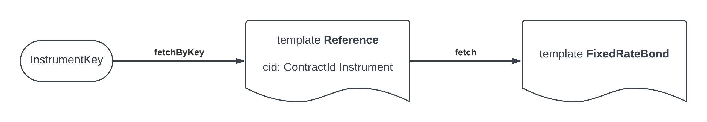

.. Copyright (c) 2024 Digital Asset (Switzerland) GmbH and/or its affiliates. All rights reserved.
.. SPDX-License-Identifier: Apache-2.0

Patterns
########

This page explains some common design patterns used in the Daml Finance library.

.. _factory-pattern:

Factory pattern
---------------

Factories are helper contracts that are used to create instruments, holdings, and other contracts.
The reason why using factories is a recommended pattern when using Daml Finance
has to do with application decoupling / upgradeability of your application.

For example, suppose that you are writing Daml code to issue equity instruments. Your workflow
references the version ``0.2.1`` of the
:ref:`Equity implementation package <module-daml-finance-instrument-equity-v0-instrument-40246>`
and at some point creates an instrument as follows.

.. code-block:: daml

   create Equity.Instrument with
     issuer = myParty
     id = Id "MyCompany"
     ..

If the equity package gets updated to version ``0.2.2`` and a new field is added to the instrument
(or a choice is changed, or a new lifecycle event is added, …) then you are forced to upgrade your
Daml code in order to use the new feature and will have to deal with upgrading multiple templates
on the ledger.

A safer approach is for your Daml code to only reference the
:ref:`Equity interface package <module-daml-finance-interface-instrument-equity-v0-instrument-90217>`,
which contains interface definitions and is updated less frequently.

However, you would now need a way to create equity instruments without referencing
``Daml.Finance.Instrument.Equity.V0`` in your main Daml workflow. To do this, you can setup a Script
to run during ledger initialisation that will create a
:ref:`factory contract <module-daml-finance-instrument-equity-v0-factory-49978>`
and cast it to the corresponding
:ref:`interface <module-daml-finance-interface-instrument-equity-v0-factory-67939>`.
You can then use the factory in your main workflow code to create the instruments.

When an upgraded instrument comes along, you would need to write code to archive the old factory and
create the new one, in order to issue the new instruments. However, the Daml code for your workflow
could in principle stay untouched.

For an example where the Factory pattern is used, check out the
:doc:`Holdings tutorial <../tutorials/getting-started/holdings>`.

.. _reference-pattern:

Reference pattern
-----------------

The Reference pattern is used to leverage the functionalities of :ref:`Contract Keys <contractkeys>`
when working with interfaces. This is required as there is currently no built-in support at the
language level for interface keys.

We want for instance to use an
:ref:`InstrumentKey <constr-daml-finance-interface-types-common-v3-types-instrumentkey-49116>` to
identify instruments across a number of implementing templates.

To do that, we define a `Reference` template that
 - is keyed by the `InstrumentKey`
 - contains the interface contract id of the target instrument

You can then fetch an interface "by key" by
 - fetching the `Reference` template by key (``fetchByKey``)
 - reading and ``fetch``-ing the stored contract id

Similarly, this pattern let you exercise a choice on an interface "by key".

The Reference pattern is currently used in Daml Finance for instruments, accounts, and the holding
factory. To maintain synchronization between a template and its corresponding `Reference`, we
simultaneously create (archive) instances of both. Additionally, if the contract id of the target
template changes, we update the `Reference` instance accordingly.

It is important to understand this pattern should you implement custom instruments, accounts or
holding factories.

.. _getview:

View of an interface contract and the `GetView` choice
------------------------------------------------------

There are different ways to access the data of a contract, for example the terms of an instrument:

#. :ref:`fetch <daml-ref-fetch>` the interface contract using its contract ID (this requires the
   submitting party to be a stakeholder of the contract). It is then possible to use the ``view``
   built-in method to get the interface view.
#. ``GetView``: by calling this choice on the interface, for example on a
   :ref:`callable bond <module-daml-finance-interface-instrument-bond-v3-callable-instrument-14719>`,
   a party can get the view of a contract, without necessarily being a stakeholder of the contract.
   This can be useful in situations where someone needs access to reference data, but should not be
   a stakeholder of the contract. Specifically, if *publicParty* is an observer of an instrumentCid,
   a party would only require readAs rights of *publicParty* in order to exercise ``GetView``. In
   the Daml Finance library, this choice has been implemented not only for instruments but also for
   other types of contracts, e.g.
   :ref:`Holdings <module-daml-finance-interface-holding-v4-fungible-55495>` and lifecycle related
   contracts like
   :ref:`Rule <module-daml-finance-interface-lifecycle-v4-rule-lifecycle-8270>` and
   :ref:`Effect <module-daml-finance-interface-lifecycle-v4-effect-48507>`.
