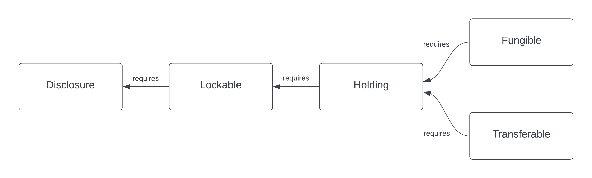

.. Copyright (c) 2023 Digital Asset (Switzerland) GmbH and/or its affiliates. All rights reserved.
.. SPDX-License-Identifier: Apache-2.0

Transfer
########

This tutorial introduces the core asset model of the library through a simple example. The purpose
is to illustrate the concepts of :ref:`account <account>`, :ref:`instrument <instrument>`, and
:ref:`holding <holding>`, as well as showing how to work with Daml interfaces.

We are going to:

#. create accounts for Alice and Bob at the Bank
#. issue a cash instrument
#. credit a cash holding to Alice’s account
#. transfer the holding from Alice to Bob

We expect the reader to be familiar with the basic building blocks of Daml. If that is not the case,
a suitable introduction can be found `here <https://www.digitalasset.com/developers/learn>`_.
In particular, `An Introduction to Daml <https://docs.daml.com/daml/intro/0_Intro.html>`_
would be a good starting point.

Download the Code for the Tutorial
**********************************

As a prerequisite, the `Daml SDK <https://docs.daml.com/getting-started/installation.html>`_ needs
to be installed on your machine.

Open a terminal and run:

.. code-block:: shell

   daml new quickstart-finance --template quickstart-finance

This creates a new folder with contents from our template. Navigate to the folder and then run the
following to download the required ``daml-finance`` packages:

.. code-block:: shell

   ./get-dependencies.sh

Then run the following to open the code editor and inspect the code:

.. code-block:: shell

   daml studio

.. _structure-of-code-dependencies:

Structure of the Code and Dependencies
**************************************

The code includes

- four workflows defined in the ``Workflows`` folder
- three Daml scripts defined in the ``Scripts`` folder

The ``Workflows`` encapsulate the core business logic of the application, whereas the ``Scripts``
are meant to be executed on a one-off basis.

If you take a closer look at the ``Workflows``, you will recognize three initiate / accept patterns
to:

- create an account
- make a deposit to the account
- execute a holding transfer

The ``DvP`` workflow will be used in the next tutorial, so please ignore that one for now.

Modules in the ``Workflows`` folder depend only on *interface* packages of ``daml-finance`` (the
packages that start with ``Daml.Finance.Interface.*``), as you can see from the import list.

This is important, as it decouples the user-defined business logic from the template implementations
used in ``daml-finance`` which makes it easier to upgrade the application. The user-defined business
logic in the ``Workflows`` will not need to be modified nor re-compiled to work with
upgraded (ie., newer versions of) *implementation* packages.

On the other hand, modules in the ``Scripts`` folder depend on both the *interface* packages and
the *implementation* packages (in this case, ``Daml.Finance.Account``, ``Daml.Finance.Holding``,
and ``Daml.Finance.Instrument.Token``). This is not problematic as scripts are meant to be run only
once when the application is initialized.

Run the Transfer Script
***********************

Let us now explore the ``Transfer`` script step-by-step.

Create ``Holding`` and ``Account`` Factories
============================================

The first instruction instantiates an account factory. This is just a template that is used by a
party (the Bank in this case) to create accounts as part of the ``CreateAccount`` workflow.

.. literalinclude:: ../../../code-samples/getting-started/daml/Scripts/Transfer.daml
  :language: daml
  :start-after: -- CREATE_ACCOUNT_FACTORY_BEGIN
  :end-before: -- CREATE_ACCOUNT_FACTORY_END

Notice how the ``ContractId`` is immediately converted to an interface upon creation: this is
because our workflows do not have any knowledge of concrete template implementations.

Similarly, we define a holding factory, which is used within an account to ``Credit`` and ``Debit``
holdings.

.. literalinclude:: ../../../code-samples/getting-started/daml/Scripts/Transfer.daml
  :language: daml
  :start-after: -- CREATE_HOLDING_FACTORY_BEGIN
  :end-before: -- CREATE_HOLDING_FACTORY_END

This factory contract can be used to create
:ref:`Fungible <type-daml-finance-holding-fungible-factory-35358>` holdings, which are defined in
:ref:`Daml.Finance.Holding.Fungible <module-daml-finance-holding-fungible-7201>`
and are both :ref:`fungible <fungibility>`, as well as :ref:`transferable <transferability>`.

We are adding a so-called *public party* as an observer to the holding factory. This is done to
ensure that every other party has visibility over this contract, as all parties can `readAs` the
public party. The reason why this is necessary will be shown at the end of this tutorial.

Open Alice’s and Bob’s Accounts
===============================

Once the factory templates are setup, we leverage our ``CreateAccount`` workflow to create accounts
at the Bank for Alice and Bob.

The creation of an account needs to be authorized by both the ``custodian`` and the ``owner``, i.e.,
by the Bank and Alice in our case. Authorization is collected using an initiate / accept pattern.

.. literalinclude:: ../../../code-samples/getting-started/daml/Scripts/Transfer.daml
  :language: daml
  :start-after: -- SETUP_ALICE_ACCOUNT_BEGIN
  :end-before: -- SETUP_ALICE_ACCOUNT_END

Bob’s account is created in a similar fashion.

Create the Cash Instrument
==========================

In order to credit Alice’s account with some cash, we first introduce a cash
:ref:`Instrument <type-daml-finance-interface-instrument-token-instrument-instrument-4350>`
in our model.

.. literalinclude:: ../../../code-samples/getting-started/daml/Scripts/Transfer.daml
  :language: daml
  :start-after: -- ISSUE_CASH_INSTRUMENT_BEGIN
  :end-before: -- ISSUE_CASH_INSTRUMENT_END

An instrument is a representation of what it is that we are holding against the bank. It can be as
simple as just a textual label (like in this case) or it can include complex on-ledger lifecycling
logic.

To hold one unit of the cash instrument in this scenario means that we can claim USD 1 from the
custodian of the holding.

Notice how in this case the Bank acts both as the issuer and depository of the cash instrument. This
means that we fully trust the Bank with any action concerning the instrument.

Deposit Cash in Alice’s Account
===============================

We can now deposit cash in Alice’s account, using the ``CreditAccount`` workflow.

.. literalinclude:: ../../../code-samples/getting-started/daml/Scripts/Transfer.daml
  :language: daml
  :start-after: -- CREATE_ALICE_HOLDING_BEGIN
  :end-before: -- CREATE_ALICE_HOLDING_END

Alice creates a request to deposit ``USD 1000`` at the Bank, the Bank then accepts the request and
a corresponding
:ref:`Holding <type-daml-finance-interface-holding-base-base-14854>` is created.

You can imagine that the latter step happens only after Alice has shown up at the bank and
delivered physical banknotes corresponding to the amount of the deposit.

Transfer Cash from Alice to Bob
===============================

The final step of our ``Setup`` script transfers Alice’s holding to Bob using the ``Transfer``
workflow. In our tutorial example, the receiver of the cash makes the transfer request:

.. literalinclude:: ../../../code-samples/getting-started/daml/Scripts/Transfer.daml
  :language: daml
  :start-after: -- TRANSFER_BEGIN
  :end-before: -- TRANSFER_END

Bob requests the cash to be transferred to his account. Alice then accepts the request.

You notice that here we make explicit use of the fact that Alice can ``readAs`` the public party.
This is needed as, in order to complete the transfer, visibility on the receiving account's holding
factory is required.

Frequently Asked Questions
**************************

How does the ``Transfer`` workflow work?
========================================

If you look at the implementation of the ``Transfer`` workflow, you will notice the following lines:

.. literalinclude:: ../../../code-samples/getting-started/daml/Workflow/Transfer.daml
  :language: daml
  :start-after: -- DO_TRANSFER_BEGIN
  :end-before: -- DO_TRANSFER_END

The first line converts the holding contract id (of type
:ref:`ContractId Holding.I <type-daml-finance-interface-holding-base-base-14854>`) to the
:ref:`Transferable.I <type-daml-finance-interface-holding-transferable-transferable-24986>`
interface using ``coerceInterfaceContractId``.

Then, the ``Transfer`` choice, defined as part of the
:ref:`Transferable <type-daml-finance-interface-holding-transferable-transferable-24986>`
interface, is invoked.

Finally, the new holding is converted back to a
:ref:`Holding.I <type-daml-finance-interface-holding-base-base-14854>`
before it is returned. This is done using ``toInterfaceContractId``.

In order to fully understand these instructions, we need to keep in mind the interface hierarchy
used by our holding implementation.

        Transferable, and Fungible are each linked by arrows pointing left. Below is an arrow, also
        pointing left, labelled Implements.

We use ``coerceInterfaceContractId`` to convert the
:ref:`Holding.I <type-daml-finance-interface-holding-base-base-14854>`
to a
:ref:`Transferable <type-daml-finance-interface-holding-transferable-transferable-24986>`.
The success of this
operation is not guaranteed and will result in a run-time error if the holding implementation at
hand does not implement
:ref:`Transferable <type-daml-finance-interface-holding-transferable-transferable-24986>`.

We use ``toInterfaceContractId`` to convert back to a
:ref:`Holding <type-daml-finance-interface-holding-base-base-14854>`.
This is because all
:ref:`Transferable <type-daml-finance-interface-holding-transferable-transferable-24986>`\ s
implement the
:ref:`Holding.I <type-daml-finance-interface-holding-base-base-14854>` interface,
so the validity of this operation is
guaranteed at compile-time.

Why is Alice an observer on Bob’s account?
==========================================

You might have noticed that Alice is an observer of Bob’s account and you might be wondering why
this is the case.

This is because the party exercising the ``Transfer`` choice, which in this case is Alice, needs to
fetch Bob’s account in order to verify that it has not been archived.

If we wanted to avoid Bob’s account contract ever being disclosed to Alice, we would need a third
party (in this case the Bank) to execute the ``Transfer``.

What are accounts used for?
===========================

An account is used as the proof of a business relationship between an owner and a custodian: Alice
may transfer cash to Bob because Bob has a valid account at the Bank.

This is done to avoid that Alice transfers cash to Charlie without Charlie being vetted and
acknowledged by the Bank.

The account is also used to determine who actually authorizes incoming and outgoing transfers. For
the account at hand, the owner acts as a controller for both incoming and outgoing transfers. For an
other account, you could for example let the custodian be the controller instead.

Why do we need factories?
=========================

You might be wondering why we use account factories and holding factories instead of creating an
:ref:`Account <type-daml-finance-account-account-account-12745>` or
:ref:`Holding <type-daml-finance-holding-fungible-fungible-28517>`
directly.

This is done to avoid having to reference ``Daml.Finance.Holding`` directly in user workflows (and
hence simplify upgrading procedures).

This is based on the assumption that there are very few factory contracts which are setup on ledger
initialization.

Exercises
*********

There are a couple of improvements to the code that can be implemented as an exercise. They will
help you familiarize yourself with the library and with Daml interfaces.

Split the Holding to Transfer the Right Amount
==============================================

In the example, Bob requests ``USD 1000`` from Alice and Alice allocates a holding for exactly the
right amount, because the transfer would otherwise fail. We want the transfer to be successful also
if Alice allocates a holding for a larger amount e.g., ``USD 1500``.

We can leverage the fact that the holding implements the
:ref:`Fungible <type-daml-finance-interface-holding-fungible-fungible-60176>`
interface, which makes it possible to ``Split`` it into a holding of ``USD 1000`` and one of
``USD 500``. In the implementation of the ``CashTransferRequest_Accept`` choice:

- cast the allocated holding to the :ref:`Fungible
  <type-daml-finance-interface-holding-fungible-fungible-60176>` interface
- use the ``Split`` choice to split the larger holding into two holdings
- execute the transfer, allocating the holding with the correct amount

In the last step, you will need to cast the
:ref:`Fungible <type-daml-finance-interface-holding-fungible-fungible-60176>` to a
:ref:`Transferable <type-daml-finance-interface-holding-transferable-transferable-24986>`
using ``toInterfaceContractId``.

Temporary Account Disclosure
============================

There is no reason for Alice to be an observer on Bob's account before the transfer is initiated by
Bob (and after the transfer is executed).

Modify the original code, such that:

- Bob's account is disclosed to Alice once the transfer is initiated
- When the Transfer is executed, Alice removes herself from the account observers

In order to do that, you can leverage the fact that
:ref:`Account <type-daml-finance-account-account-account-12745>`
implements the
:ref:`Disclosure <type-daml-finance-interface-util-disclosure-disclosure-97052>`
interface. This interface exposes the ``AddObservers`` and ``RemoveObservers`` choices, which can be
used to disclose / undisclose Bob's account contract to Alice. In order to exercise these choices,
you can use the :ref:`Account.exerciseInterfaceByKey
<function-daml-finance-interface-account-account-exerciseinterfacebykey-13671>` utility function.

Summary
*******

You know how to setup basic accounts, holdings and instruments. You also learned how to perform a
simple transfer. The key concepts to take away are:

* Holdings represent the ownership of a financial instrument at a custodian.
* Instruments define the economic terms of a financial contract.
* Accounts ensure that only known parties can obtain ownership.
* Factories are used to create the respective contracts without having to depend on implementation
  packages.
* Transfers change ownership of a holding.

Ownership transfers typically happen as part of a larger financial transaction. The next tutorial
will show you how to create such a transaction and how to settle it atomically.
